# Member Avatar & Status [MAS]
   
This Extension Lets Admin to display User's Avatar & it's Online Status on *Index* , *Memberlist* , *The Team* , *Viewonline[Who is online]* , *Who Is Online Stat Block* , *Viewforum* , *Search* , *Posting Topic Review* , *MCP Topic Review* , *PM History Review* .  ;)   
   
   
#### Status Badge for Member Avatar & Status [MAS] on phpBB v3.2.x :   
 :    
 :     
 :    
 :       
   
   
## **Features:**   
   
1. Option to Display Only User Avatar.   
2. Option to set User Avatar size to be displayed, with sample Avatar for easy viewing.   
3. Option to Display Only User Online Status.   
4. Display User Avatar & Online Status in Member Page.   
5. Display User Avatar & Online Status in The Team Page.   
6. Display User Avatar & Online Status in all Member Group Pages.   
7. Display User Avatar in ViewOnline [Who is online] Page.   
8. Display User Avatar in "Who Is Online" Statistic Block at bottom of every Page wherever it Exists.   
9. Display User Avatar & Online Status in Index Page for Last Poster.   
10. Display User Avatar & Online Status in all Viewforum Pages for First & Last Poster.   
11. Display User Avatar & Online Status in all Search Pages for Topic First & Last Poster & Post User.   
12. Display User Avatar & Online Status in Posting Topic Review for Post User.   
13. Display User Avatar & Online Status in MCP Topic Review for Post User.   
14. Display User Avatar & Online Status in PM History Review for Post User.   
15. Display Overview of all Settings on One Page in ACP.   
16. Display if phpBB's Avatar & Online Tracking is enabled or not in Overview Page in ACP.   
17. All settings are Organized in their respective section in ACP for easy Management.   
18. Currently there are 5 sections in ACP : *Memberlist* ,  *Viewonline* , *Viewforum* , *Search* , *Review* .   
   
   
## **ScreenShot:**   
1. Index Page:   
[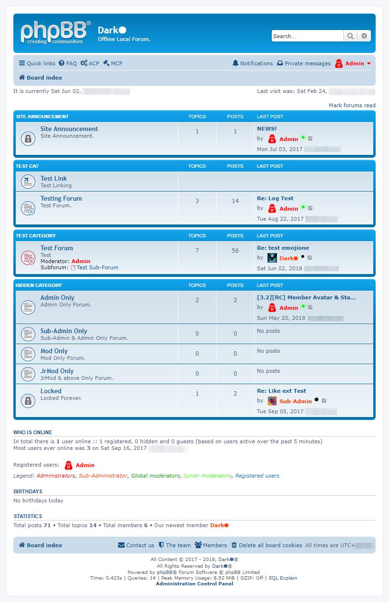](./MAS-IMG/01.Index.png)   
   
2. MemberList Members Page:   
[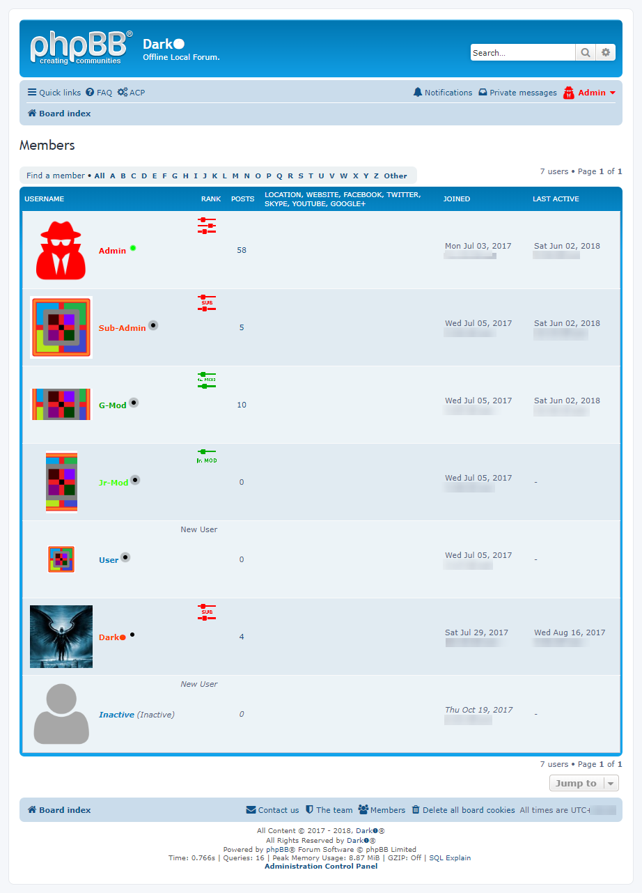](./MAS-IMG/02.MemberListMembers.png)   
   
3. MemberList Team Page:   
[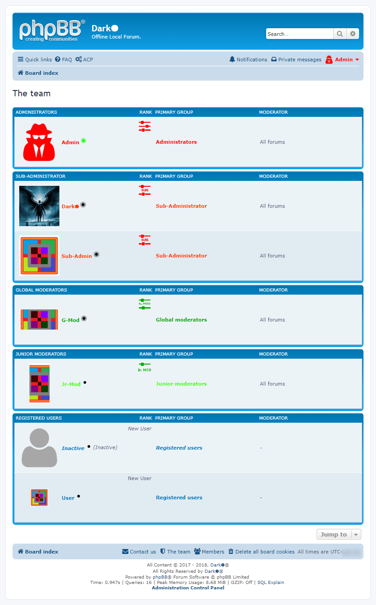](./MAS-IMG/03.MemberListTeam.png)   
   
4. ViewOnline "Who is Online" Page:   
[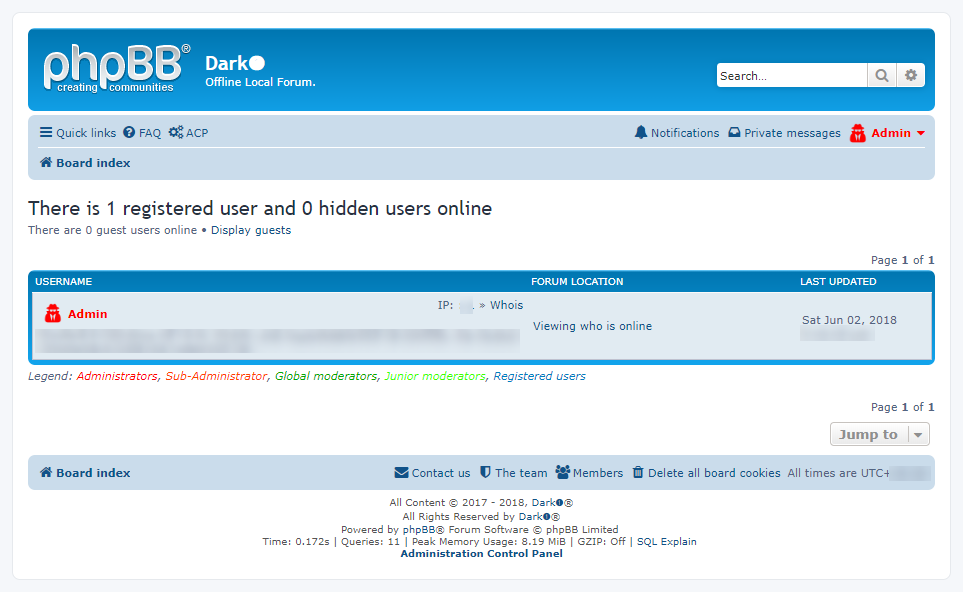](./MAS-IMG/04.ViewOnlinePage.png)   
   
5. ViewForum Category Page:   
[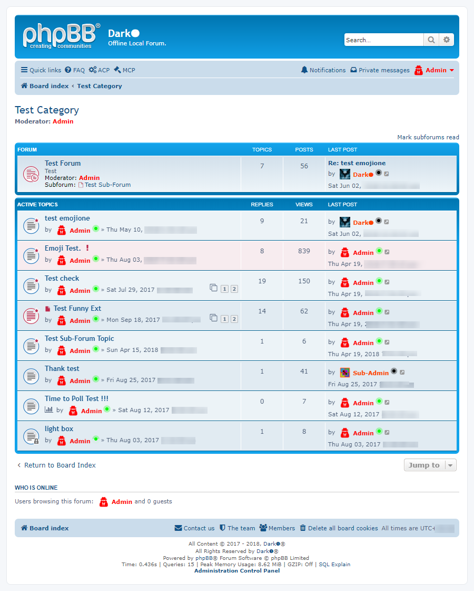](./MAS-IMG/05.ViewForumCategory.png)   
   
6. ViewForum Forum Page:   
[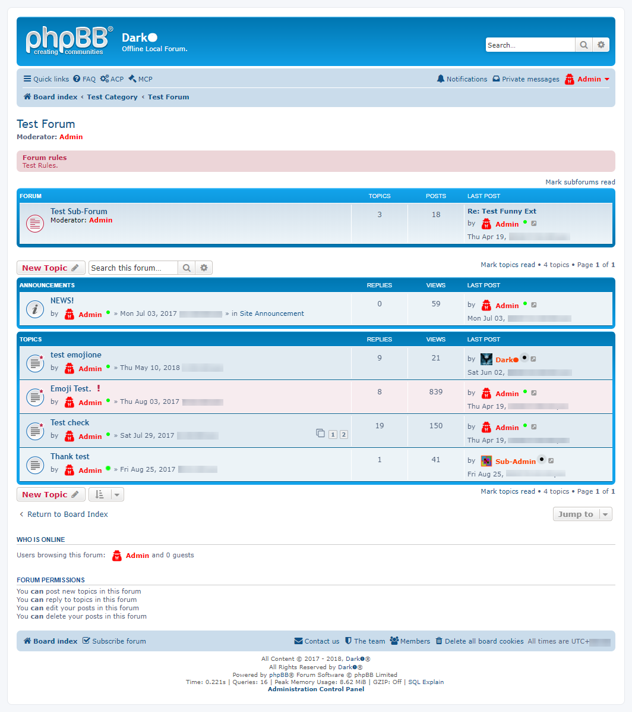](./MAS-IMG/06.ViewForumForum.png)   
   
7. Search Topics Page:   
[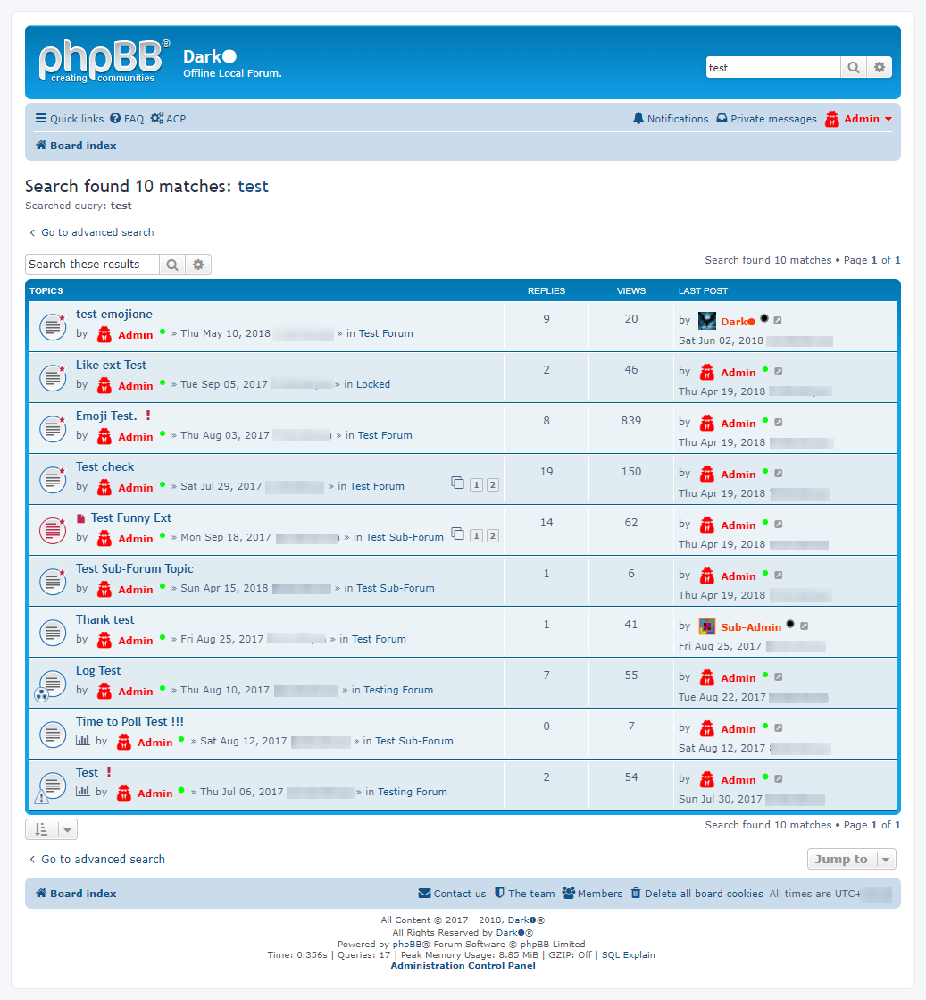](./MAS-IMG/07.SearchTopics.png)   
   
8. 08.SearchPosts Page:   
[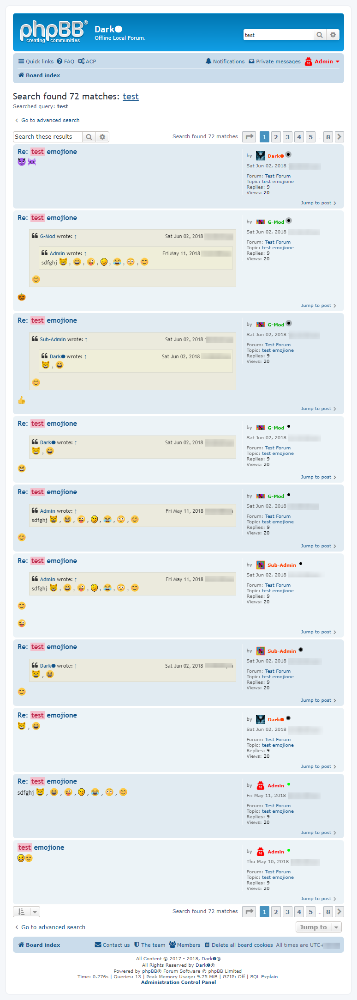](./MAS-IMG/08.SearchPosts.png)   
   
9. ACP Overview Page:   
[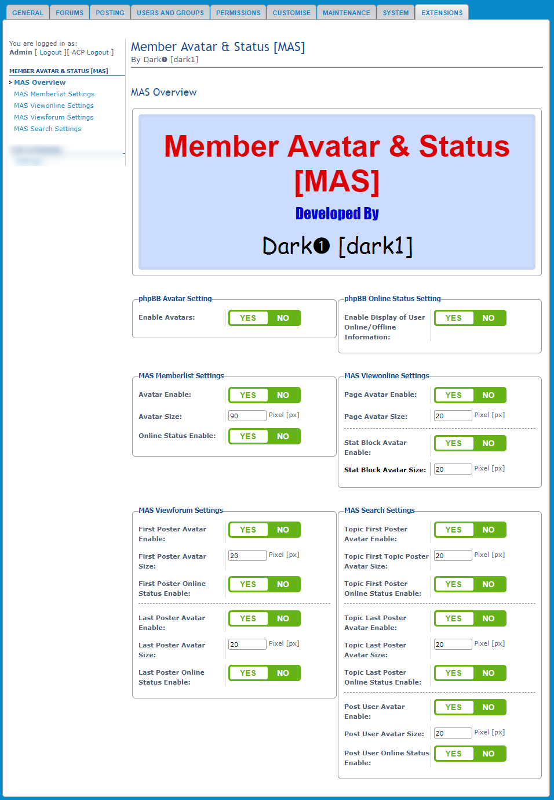](./MAS-IMG/09.AcpOverview.png)   
   
10. ACP Overview-2 Page:   
[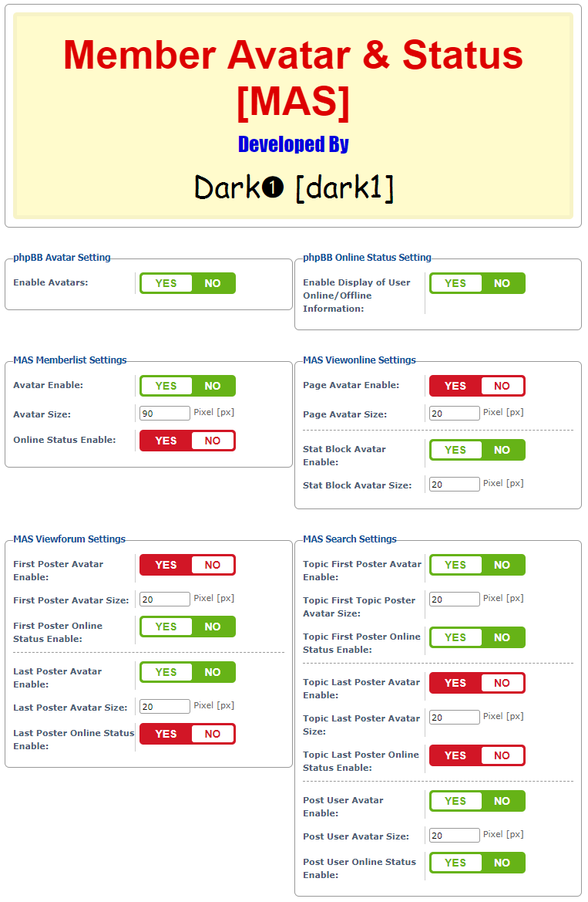](./MAS-IMG/10.AcpOverview2.png)   
   
11. ACP MemberList Page:   
[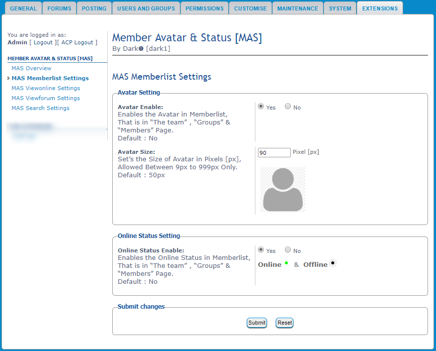](./MAS-IMG/11.AcpMemberList.png)   
   
12. ACP ViewOnline Page:   
[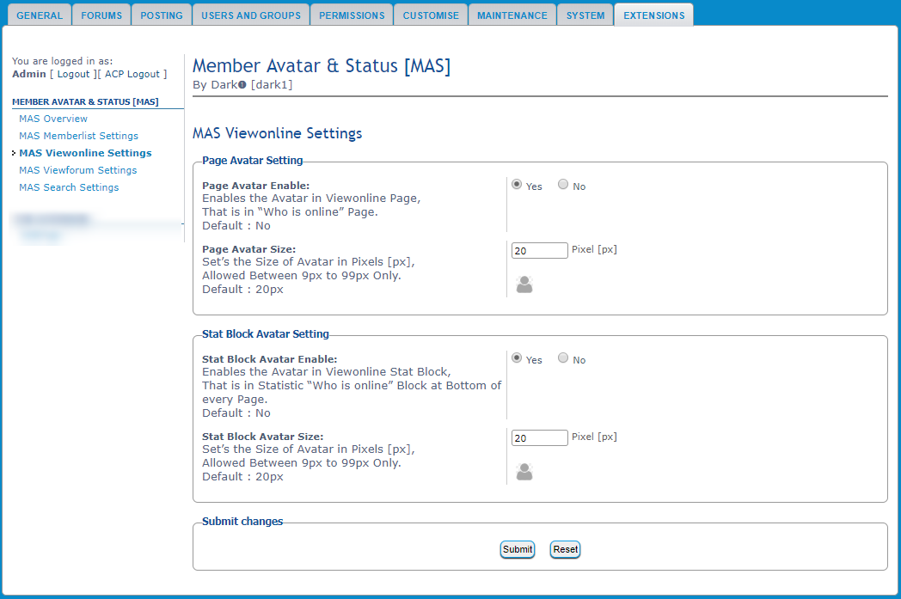](./MAS-IMG/12.AcpViewOnline.png)   
   
13. ACP ViewForum Page:   
[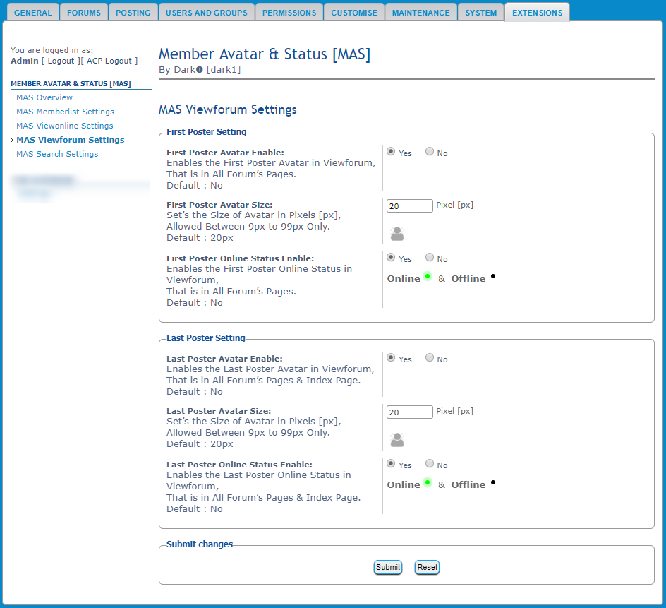](./MAS-IMG/13.AcpViewForum.png)   
   
14. ACP Search Page:   
[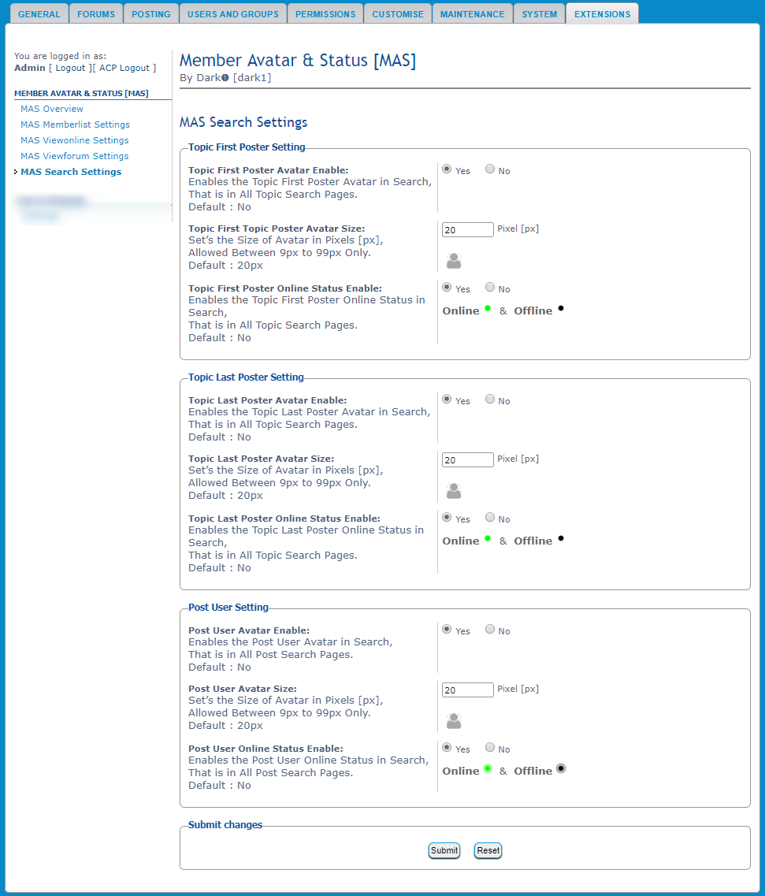](./MAS-IMG/14.AcpSearch.png)   
   
15. ACP Online & Offline Animation:   
   
   
16. Avatar , Online & Offline Animation:   
[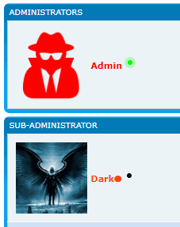](./MAS-IMG/16.AvatarOnlineOffline.gif)   
   
   
## **Installation:**   
   
1. Download and unzip the Latest release.   
2. Copy the `dark1/memberavatarstatus` folder to `/ext/dark1/memberavatarstatus`.   
3. Navigate in the `ACP` to `Customise` -> `Manage extensions`.   
4. Look for `Member Avatar & Status` under the `Disabled Extensions` list, and click the `Enable` link.   
5. Set up and configure the `Member Avatar & Status` extension by navigating in the `ACP` to `Extensions` -> `Member Avatar & Status [MAS]`.   
6. If required Purge the cache in `ACP` & also if required then in your Browser.   
7. D0Ne !!! EnJ0Y  :D   
   
Detailed phpBB standard Installation of Extensions here : [phpBB Extensions Installing](https://www.phpbb.com/extensions/installing/#installing)   
   
   
## **Updation:**   
   
1. Navigate in the `ACP` to `Customise` -> `Manage extensions`.   
2. Look for `Member Avatar & Status` under the `Enabled Extensions` list, and click the `Disable` link.   
3. Delete the Files from the `dark1/memberavatarstatus` folder at `/ext/dark1/memberavatarstatus`.   
4. Download and unzip the new Latest release Files.   
5. Copy the new Latest release Files from the `dark1/memberavatarstatus` folder to `/ext/dark1/memberavatarstatus`.   
6. Look for `Member Avatar & Status` under the `Disabled Extensions` list, and click the `Enable` link.   
7. D0Ne !!! EnJ0Y  :D   
   
Detailed phpBB standard Updation of Extensions here : [phpBB Extensions Updating](https://www.phpbb.com/extensions/installing/#updating)   
   
   
## **Uninstallation:**   
   
1. Navigate in the `ACP` to `Customise` -> `Manage extensions`.   
2. Look for `Member Avatar & Status` under the `Enabled Extensions` list, and click the `Disable` link.   
3. If want to Fully Uninstall then Look for `Member Avatar & Status` under the `Disabled Extensions` list, and click the `Delete data` link.   
4. At this point you can re-enable the extension, it will be as if it were being installed for the first time.   
5. If want to Remove the Files then delete the `dark1/memberavatarstatus` folder from `/ext/dark1/memberavatarstatus`.   
6. If required Purge the cache in `ACP` & also if required then in your Browser.   
7. D0Ne !!! EnJ0Y  :D   
   
Detailed phpBB standard Uninstallation of Extensions here : [phpBB Extensions Removing](https://www.phpbb.com/extensions/installing/#removing)   
   
   
GitHub Repository: [memberavatarstatus](https://github.com/dark-1/memberavatarstatus)   
phpBB Customisation Database Extension: [Member Avatar & Status](https://www.phpbb.com/customise/db/extension/member_avatar_status/)   
For more Details Go Here : [[3.2][RC] Member Avatar & Status [MAS]](https://www.phpbb.com/community/viewtopic.php?t=2474156)   
   
   
## License GPLv2
   
--------------   
EnJoY  :D   
Best Regards.  :)   
   
